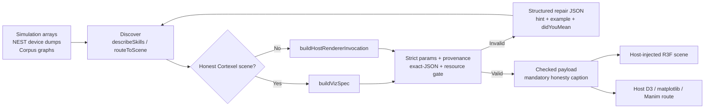
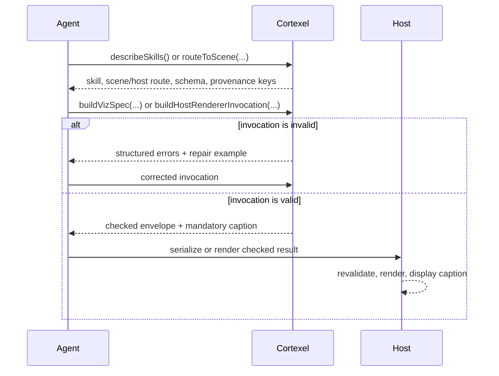

# Cortexel

[](https://github.com/sepahead/cortexel/actions/workflows/ci.yml)
[](./LICENSE)
[](#)

**Cortexel** is an agent-consumable scientific-visualization *contract* for neural
simulations. An AI agent emits a declarative **`VizSpec`** (plain JSON); Cortexel
validates it, routes it to a scene, and enforces **scientific-honesty provenance
fail-closed** — then a host-injected renderer draws it. Cortexel ships the reusable
scene primitives (a population voxel hub, a point-neuron cloud, a complete 3D
knowledge graph) plus the design-law and colour system those renderers share.

It is built for AI agents — with a custom harness and skills — that need a *typed,
honest path* from simulator output to a figure without hand-rolling validation or
provenance: a paper → simulation → visualization pipeline. The whole agent-facing
API lives in `cortexel/core`, which is dependency-free beyond `zod` and runs
server-side.

> **What Cortexel is (and isn't).** It is the validation, routing, honesty and
> design-contract layer — not a batteries-included chart library. The `react` layer
> ships shared scene *primitives* and one complete scene (the 3D knowledge graph);
> the concrete per-scene r3f components (spike raster, Brunel network, STDP, …) are
> injected by the host via `renderScene`. Headless render-to-image/video is on the
> roadmap. `0.5.0` — pre-`1.0`, APIs may still change.

**New here?**
[**AGENTS.md**](./AGENTS.md) is the integration guide for an agent *building figures
with* Cortexel; [**CLAUDE.md**](./CLAUDE.md) is for *working on* Cortexel itself.

## Visual overview



### Visualization coverage

| Visualization | Skill or primitive | Render target | Typical use | Shipping status |
|---------------|--------------------|---------------|-------------|-----------------|
| Spike raster | `nest.spike_raster` | `spike-raster` | Population timing, synchrony, burst structure | Contract + host-injected scene |
| Voltage or analog trace | `nest.voltage_trace`, `nest.astrocyte_dynamics` | `voltage-trace` | Membrane dynamics or explicitly disclosed glial signals | Contract + host-injected scene |
| F-I / rate-response curve | `nest.rate_response` | `fi-curve` | Excitability and stimulus-response comparison | Contract + host-injected scene |
| Connectivity or spatial network | `nest.connectivity_matrix`, `nest.spatial_3d` | `network-topology` | Synaptic structure or unit-labelled 3D positions | Contract + host-injected scene |
| Plasticity dynamics | `nest.plasticity_dynamics` | `stdp` | Weight evolution and learning-window analysis | Contract + host-injected scene |
| Phase plane | `nest.phase_plane` | `phase-plane` | State-space flow and fixed-point reasoning | Contract + host-injected scene |
| Corpus knowledge graph | `corpus.knowledge_graph` | `knowledge-graph-3d` | Paper → model → family evidence exploration | Complete Canvas-less R3F scene + DOM companion |
| Population and neuron expansion | `ExpandablePopulation`, `ExpandableNeurons` | Host Canvas | Interactive multiscale neural explainers | Reusable R3F primitives + DOM companions |
| Correlogram, 2D spatial, protocol, morphology, replay | Five `scene:null` skills | D3 / matplotlib / Manim | Analyses with no honest Cortexel scene yet | Strict checked host-renderer route |

## Use cases

| Goal | Cortexel workflow | Why it helps |
|------|-------------------|--------------|
| Autonomous NEST report generation | Normalize a raw device dict into host `SceneData` as needed, route its family, then author matching skill params with `buildVizSpec`. | The adapter and VizSpec gate stay distinct, and the agent never invents a scene, units, or provenance shape. |
| Simulation QA and regression figures | Validate axes and identities, call `detectEmptyScene`, and reject malformed or blank render data before pixels exist. | Broken recorder output fails before it becomes a convincing but empty figure. |
| Paper-to-simulation evidence maps | Author `corpus.knowledge_graph`, map its validated params with `mapCorpusKnowledgeGraph`, and render the supplied 3D graph plus `KnowledgeGraphA11yList`. | Advisory identity edges and force-layout geometry remain explicitly non-evidentiary. |
| Safety gateway for LLM-generated visuals | Put `validateSpec` or `validateHostRendererSpec` between agent output and every renderer. | Unknown fields, contradictory units, oversized inputs, and unsupported claims fail closed. |
| Python or Rust visualization backends | Consume `cortexel/skills.manifest.json` and implement its JSON Schemas, defaults, portable constraints, and honesty policy. | Non-TypeScript agents share the same versioned contract as the TypeScript runtime. |
| Interactive neural explainers | Combine population/neuron primitives with host-owned Canvas controls and the exported DOM selection companions. | One interaction model serves pointer, keyboard, screen-reader, and reduced-motion users. |
| Reproducible figure archives | Store the self-describing validated envelope (`skill` + `specVersion`) and re-run the strict gate when loading it. | The figure request remains auditable without an undocumented side channel. |

## Install

```bash
# Until the first npm-registry release, install the repository package:
npm install github:sepahead/cortexel

# Once the registry package is published:
npm install cortexel                 # pulls zod automatically

# The react rendering layer needs these peers:
npm install react react-dom three @react-three/fiber

# TypeScript projects also need the React/three declarations:
npm install --save-dev @types/react @types/react-dom @types/three

# Only if you render the 3D knowledge graph (cortexel/react/knowledge-graph):
npm install d3-force-3d
```

`cortexel/core` is dependency-free beyond `zod` and safe to import server-side.
`cortexel/react` needs the react / react-dom / three / react-three-fiber peers. `d3-force-3d` is needed
**only** by the `cortexel/react/knowledge-graph` subpath.

## Quickstart

**Author + validate a spec in one call** (pure Node, no react). This is the agent's
happy path: `buildVizSpec` fills in the scene and the fail-closed provenance baseline,
then runs the strict gate — you get back a render-ready spec or the exact fix.

```ts
import { buildVizSpec, formatInvocationErrors } from 'cortexel/core';

const result = buildVizSpec({
  skill: 'nest.spike_raster',
  params: { times_ms: [1, 2, 3, 5, 8], senders: [1, 2, 1, 3, 2] },
  source: 'nest_simulation:run-42',
  declaredInputs: {                       // the keys this skill's honesty contract needs
    recorder_id: 'sr_1',
    sender_ids: '[1,2,3]',
    population_labels: 'E',
    time_units: 'ms',
  },
});

if (result.ok) {
  render(result.spec, result.caption);    // caption is the fail-closed disclosure
} else {
  console.error(formatInvocationErrors(result.errors)); // a copyable repair block
}
```

**Render it** (react). The spec is self-describing (`skill` + `specVersion`), so
`VizSpecRenderer` re-runs the same strict gate and overlays the caption — you inject
the concrete scene; Cortexel enforces the contract and stays host-agnostic:

```tsx
import { VizSpecRenderer } from 'cortexel/react';

export function Figure({ spec }) {
  return (
    <VizSpecRenderer
      spec={spec}                          // self-describing → strict gate runs automatically
      // Cortexel is host-agnostic: YOU inject the scene. It receives the VALIDATED
      // params + provenance + resolved palette.
      renderScene={({ skill, scene, themeMode, params, palette }) => (
        <MySpikeRaster skill={skill} data={params} themeMode={themeMode} palette={palette} />
      )}
      onError={(errors) => console.warn('Invalid VizSpec', errors)}
    />
  );
}
```

## The agent loop

An autonomous agent runs four steps; **[AGENTS.md](./AGENTS.md) is the full guide.**
The core API in one glance:

```ts
import {
  describeSkills,          // 1. discover: scene, params (JSON Schema), provenance, example
  routeToScene,            //    or route a device family → a skill/scene (fail-closed)
  buildVizSpec,            // 2. author + validate in one call
  buildHostRendererInvocation, // scene:null equivalent; binds provenance + caption
  validateSkillParams,     // low-level params-only diagnostic (not a render gate)
  formatInvocationErrors,  // 3. prompt-safe structured JSON repair block
  validateSpec,            // 4. re-validate a stored self-describing spec (reads spec.skill)
  validateHostRendererSpec,//    re-validate a stored scene:null envelope
} from 'cortexel/core';
```



- **Discover** — `describeSkills()` returns every skill's scene, required params (as a
  **JSON Schema**), cross-field constraints, provenance keys, and a worked example.
  `routeToScene({ deviceFamily, … })` maps a NEST device family to a skill/scene and
  fails closed on unknown, mismatched, or ambiguous discriminators, handing back
  exactly what's needed to retry.
- **Author + validate** — `buildVizSpec` (above), or the lower-level
  `validateSkillInvocation(skillId, payload)` if you assemble the envelope yourself.
  For a `scene: null` skill, use `buildHostRendererInvocation` (or
  `validateHostRendererInvocation`) so params, provenance, selected route, and the
  mandatory caption remain one checked contract. `validateSkillParams` alone is not
  a final render boundary.
- **Repair** — every error carries a `hint`, a copyable `example`, and a `didYouMean`
  for a mistyped id; `formatInvocationErrors` emits deterministic JSON marked
  `untrustedData:true`, with dynamic values safely quoted for model repair.
- **Emit** — the validated spec is serializable and independently re-validatable via
  `validateSpec` (or `validateHostRendererSpec` for scene-less envelopes). Non-TS
  hosts consume the generated **`dist/skills.manifest.json`**
  (also exported as `cortexel/skills.manifest.json`) with a schema and explicit
  cross-field constraints for every skill, complete examples, exact-JSON budgets,
  envelope/default/normalization rules, binary64 + UTF-16 semantics, strict
  invocation/provenance policy, palette policy, and the caption derivation policy.

There are **14 skills** (13 `nest.*` device-output skills + `corpus.knowledge_graph`);
**9 render to a Cortexel scene**, and 5 declare `scene: null` because no honest scene
exists yet (2D spatial, correlogram, morphology, …) — those route to a host renderer
rather than being mis-drawn. See the full catalog in [AGENTS.md](./AGENTS.md).

> **Naming.** The axis is not NEST-only (`corpus.knowledge_graph` has no NEST device).
> Prefer the neutral aliases `SKILL_IDS` / `SkillId` / `SKILL_REGISTRY` / `isSkillId`;
> the `NEST_`-prefixed names remain for back-compat.

## VizSpec contract

`core/vizSpec.ts` is the runtime source of truth (Zod; `VizSpec` is inferred from it):

```ts
{ scene, params, provenance, skill?, specVersion?, mode?, themeMode?, camera?, palette? }
```

- `scene` — one of `SCENE_NAMES` (the `SceneName` union and the Zod enum derive from
  the same tuple, so they cannot drift).
- `params` — literal, bounded JSON only: finite numbers, strings, booleans, null,
  arrays and plain objects with ordinary enumerable data properties. Cycles, sparse
  or decorated arrays, accessors, symbols, `toJSON`/raw-JSON tricks, class instances,
  functions, `undefined`, `BigInt`, non-finite/unstable values, and pathological
  depth/size fail before a spec is called render-ready. Skill schemas are closed at
  the top level, so typoed fields fail rather than being silently ignored.
  The complete envelope is capped at 500,000 JSON value nodes. Per-skill inline
  limits include 50,000 scientific samples, 50,000 spatial objects, and 1,000
  knowledge-graph nodes / 4,000 edges; aggregate/decimate larger recordings or
  pass a host-side data handle.
- `provenance` — see below; **required**. Build it fail-closed with
  `conservativeProvenance(source, declaredInputs)` (what `buildVizSpec` does for you).
- `skill?` — a self-describing skill id. When present, a stored spec is independently
  re-validatable and its honesty caption is deterministic (scene→skill is many-to-one,
  so the scene alone can't recover the skill).
- `specVersion?` — the contract era this spec targets (`CORTEXEL_SPEC_VERSION`);
  when present it must match the running contract exactly.
- `mode` — `interactive` (default) or `export`. `export` (headless) is not yet
  implemented and returns an explicit notice rather than faking a render.
- `themeMode`, `camera`, `palette` — presentation hints.

A host backend **should** mirror this schema server-side (e.g. a Pydantic model with
the same conservative defaults) as a defense-in-depth gate. Cortexel ships the
client-side gate.

Object APIs receive already-materialized values. If a payload arrives as raw JSON
text, reject duplicate object member names before parsing: ordinary `JSON.parse`
cannot reveal that an earlier member was overwritten. Stored JSON emitted by a
validated Cortexel spec is safe to parse normally.

## Honesty model (fail-closed)

Every spec carries `provenance` with the fail-closed defaults
`calibrated_posterior:false`, `advisory_only:true`,
`is_paper_local_evidence:false`, and `synthetic:false`. The renderer
shows a non-dismissible disclosure caption (`role="note"` / `aria-live`) unless the
provenance is fully rigorous — and because `calibrated_posterior=true` is rejected at
**every** entrypoint, there is currently **no accepted spec that suppresses the
caption**. Synthetic data (declared `synthetic:true`, or a `synthetic`-prefixed
source) is captioned as *schematic*; other non-rigorous data is *advisory*.

Strict gates reject unknown declared-input keys, validate every present known
value (not just required keys), and enforce portable params↔provenance consistency
where the contract can detect a contradiction—units, millisecond axes,
normalization, and similar claims. These checks cannot establish factual truth;
the producer remains responsible for truthful declarations.

The mandatory schematic/advisory prefix is derived only from machine-checkable
provenance flags. A strict gate may prepend its contract-owned weak-skill disclosure,
and an agent-supplied `provenance.caption` is appended only as a bidi-isolated,
explicit **“Caller note (unverified)”**. Neither can replace, reorder, or suppress
the mandatory prefix. This boundary is load-bearing — see
[SECURITY.md](./SECURITY.md).

A `weak` skill (a render whose *fidelity* or *data semantics* need a caveat) carries a
mandatory **derived-view** disclosure, declared per-skill so it states the real reason:
connectivity-only topology uses schematic positions/distances; astrocyte Ca²⁺/IP₃
shown through the analog-trace scene is *not* membrane voltage; and a knowledge
graph's identity edges plus force-layout geometry are advisory/non-evidentiary.

### Two rendering paths

1. **Agent path (default)** (`VizSpecRenderer` + `skillId`, or a spec with a `skill`
   field):
   validates through the strict skill gate — per-skill params, declared provenance,
   `calibrated_posterior` rejection, and the weak/derived-view disclosure — then binds
   the caption at the render boundary. **Use this for untrusted agent payloads.**
   A missing skill fails closed; deleting the discriminator cannot downgrade the gate.
2. **Trusted-envelope path** (`<VizSpecRenderer trustedEnvelope … />`): validates
   only the generic VizSpec envelope and does **not** enforce per-skill params or
   the weak disclosure. The explicit opt-in is only for trusted host-authored
   showcases, never agent/network payloads. `requiresHonestyCaption` and
   `defaultHonestyCaption` only derive disclosure text from already-validated
   trusted provenance; they are not validation gates.

Both paths always show the fail-closed caption; only the agent path additionally
enforces per-skill params and the derived-view disclosure.

The five `scene:null` skills do not use `VizSpecRenderer`; their strict equivalent is
`validateHostRendererInvocation`, whose successful result carries the checked host
envelope, allowed `rendererRoutes`, and the same mandatory caption. Hosts must display
that caption alongside their D3/matplotlib/Manim output.

## Design laws

These keep figures consistent and honest (mirrored in [CONTRIBUTING.md](./CONTRIBUTING.md)):

1. **A single neuron is a sphere; a population is a glowing voxel cube**
   (`BoxGeometry` + unlit `MeshBasic`, dimmed ×0.82 so it self-luminates under bloom
   without bleaching white).
2. **Passive data uses unlit `MeshBasic` (no emissive).** Emissive > 1.0 is reserved
   for active spike/synapse *events*; keep it bloom-safe (≤ ~1.15).
3. **Honesty fails closed** (see above).
4. **`useFrame` is allocation-free** (reuse refs / module-scope scratch objects).
5. **The library stays host-agnostic; the host owns the frame.** No host-app imports;
   scene components are injected via `renderScene`, and scene primitives are
   Canvas-less — the host owns `<Canvas>`, OrbitControls, bloom and background.

Laws 3–5 have executable guards in the test suite.

## Colour system

One perceptually-uniform colour language across every renderer (WebGL shaders, r3f
scenes, D3/SVG, and a host's matplotlib). The default is **Crameri** scientific colour
maps — `batlow` (sequential; the recommended replacement for jet/viridis) and `vik`
(diverging, for signed E/I and LTP/LTD fields). Palettes are **runtime-extensible**:
`registerPalette(name, palette, metadata)` at startup, and an agent can request one via
`VizSpec.palette` (validated against the registry on the skill path). Scene components
consume the resolved palette from `RenderSceneArgs.palette`, never module-level imports.

## Architecture

Dependency-ascending layers, each its own entrypoint:

| Entry | Deps | Contents | Status |
|-------|------|----------|--------|
| `cortexel/core` (and the root `cortexel`) | `zod` | VizSpec contract, skill axis (registry/router/validate/**author**/adapters), colormaps + palettes, GLSL strings, design-law types, provenance/honesty model, manifest | available |
| `cortexel/react` | + react / react-dom / three / r3f | `VizSpecRenderer`, `usePopulationExpand`, `ExpandablePopulation`, `ExpandableNeurons`, DOM selection companions, `neuronShaders` | available |
| `cortexel/react/knowledge-graph` | + d3-force-3d | `KnowledgeGraph3DScene`, `KnowledgeGraphA11yList`, `mapCorpusKnowledgeGraph` | available |
| `cortexel/three` | three only | headless `Scene*Builder → THREE.Group` | planned |
| `cortexel/headless` | node | render-to-PNG/MP4 | planned |

The root `cortexel` entry re-exports **only** `core`, so `import … from 'cortexel'` is
always safe server-side and never pulls in react/three. Import rendering explicitly
from `cortexel/react`.

## Scene primitives

The `react` layer ships the reusable pieces the concrete scenes are built from:

- **`ExpandablePopulation`** — the population voxel hub. Click/tap selects it; the
  owning scene collapses the hub and expands the constituent neurons. Honors
  `prefers-reduced-motion` and demand rendering. Pair it with the exported
  `PopulationA11yList`; WebGL meshes are not keyboard or screen-reader controls.
- **`ExpandableNeurons`** — the companion point-neuron sphere cloud that blooms from
  the hub centre into a 3D grid. It allocates exactly the requested neuron count (no
  phantom padding), centers partial grids, and accepts explicit normalized
  `membraneIntensity`/`spikeIntensity` arrays. Omitted activity is static zero—this
  primitive never fabricates spikes for visual liveliness. `neuronLocalGrid` /
  `neuronExpandedScale` are exported for aligned synapse placement. Linear pointer
  picking has a 25,000-neuron cap; noninteractive clouds are supported up to
  1,000,000 neurons.
  Pair selectable clouds with the paginated `NeuronA11yPager` DOM companion.
- **`usePopulationExpand`** — THREE-free selection/hover state (with an optional
  controlled override so a scene that already owns the state doesn't get a second owner).
- **`KnowledgeGraph3DScene`** (`cortexel/react/knowledge-graph`) — a complete,
  Canvas-less 3D force-directed graph: instanced unlit nodes, additive edges with
  persistent arrowheads, citation-flow particles, hover/selection emphasis and a network-free canvas-texture
  focus label, all
  ticked in an allocation-free `useFrame`. Layouts are deterministic (the same graph
  reproduces the same shape on every mount) and keyed on graph *content*, so hosts that
  rebuild their nodes/edges arrays every render never restart a settled layout; user
  camera ownership stays with the host unless it explicitly opts into `autoFrame` or
  selection fly-to; honors `reducedMotion`.
  Its companion **`mapCorpusKnowledgeGraph(params, palette)`** turns validated
  `corpus.knowledge_graph` params into the scene's node/edge props (colour by kind,
  radius by degree, flow particles on citations), so the graph renders end-to-end from
  an agent's VizSpec. `KnowledgeGraphA11yList` provides the required keyboard- and
  screen-reader-accessible, node/relationship-paginated DOM mirror for the otherwise
  pointer-driven WebGL graph.

## Roadmap

Known gaps, roughly in priority order — contributions welcome:

- **Headless export** (`mode: 'export'`, `cortexel/three`, `cortexel/headless`) — render
  a VizSpec to PNG/MP4/SVG without a browser, so an autonomous agent can produce a
  figure *artifact*. Today `export` returns an explicit 501-style notice.
- **Reference scenes** — ship a canonical `renderScene` implementation per scene so
  Cortexel is "emit a VizSpec, get a figure" out of the box, not only a contract.
- **Simulator-neutral axis** — a `generic` data-source family (plain `{times,senders}` /
  `{times,values}` arrays) so Brian2 / NEURON / arbitrary data route without claiming to
  be NEST.
- **Time-evolution** — a first-class `time` request (window/speed/loop) for animated
  scenes, instead of only the offline storyboard route.
- **Multi-figure composition** — a panel/layout envelope so an agent can request a
  multi-panel paper figure with one honesty policy.
- **Out-of-band data handles** — reference large arrays (e.g. a Brunel network's
  millions of spikes) by handle instead of inlining them in the agent's JSON.

## Development

```bash
bun install
bun run check   # typecheck + tests
bun run build   # tsup → dist/ (ESM + CJS + d.ts) + dist/skills.manifest.json
bun run audit          # dependency advisories
bun run lint:package   # export/types/package metadata validation
bun run test:package   # clean-room ESM/CJS + optional-peer smoke test
```

`dist/` is committed (git-dependency consumers install without a build step); CI
verifies it stays in sync with source. See [CLAUDE.md](./CLAUDE.md) for the invariants a
change must uphold, and [CONTRIBUTING.md](./CONTRIBUTING.md) for the workflow.

## License

[MIT](./LICENSE) © Sepehr Mahmoudian
