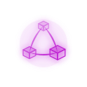
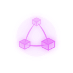
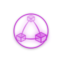
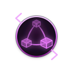
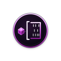
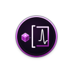
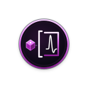

# Cortexel logo archive

This archive preserves earlier repository and profile designs.
The main README selects the active logo.
Archived artwork does not establish current behavior or release status.

[Manifest and exact source identities](manifest.json)

Repository assets retain their exact bytes.
Profile extractions retain geometry, referenced definitions, and applicable styles.
Their accessible names use explicit title and description identifiers.
No historical JavaScript was executed.
Dates identify source commits, not necessarily the original design date.

| Preview | Design | Source |
| --- | --- | --- |
|  | [2026-07-04-001-profile-light-05df6a920a](cortexel/2026-07-04-001-profile-light-05df6a920a.svg) | [e43d9f07dc](https://github.com/sepahead/sepahead/blob/e43d9f07dc6ef3246230a8b61cf6b5ddf5058a07/assets/work-graph-light.svg) |
|  | [2026-07-04-002-profile-dark-c42976e01a](cortexel/2026-07-04-002-profile-dark-c42976e01a.svg) | [e43d9f07dc](https://github.com/sepahead/sepahead/blob/e43d9f07dc6ef3246230a8b61cf6b5ddf5058a07/assets/work-graph-dark.svg) |
|  | [2026-07-10-003-profile-light-8fcd80e836](cortexel/2026-07-10-003-profile-light-8fcd80e836.svg) | [f0375ae458](https://github.com/sepahead/sepahead/blob/f0375ae4588442e39e9fb28c28387170a831cadd/assets/work-graph-light.svg) |
|  | [2026-07-10-004-profile-dark-ba0e92649a](cortexel/2026-07-10-004-profile-dark-ba0e92649a.svg) | [f0375ae458](https://github.com/sepahead/sepahead/blob/f0375ae4588442e39e9fb28c28387170a831cadd/assets/work-graph-dark.svg) |
|  | [2026-07-10-005-profile-dark-5b6b12b745](cortexel/2026-07-10-005-profile-dark-5b6b12b745.svg) | [32a11d43bb](https://github.com/sepahead/sepahead/blob/32a11d43bb57f500d940ee3c8daf2bcfd63b4f5e/assets/work-graph-dark.svg) |
|  | [2026-07-10-006-profile-light-fa335badad](cortexel/2026-07-10-006-profile-light-fa335badad.svg) | [32a11d43bb](https://github.com/sepahead/sepahead/blob/32a11d43bb57f500d940ee3c8daf2bcfd63b4f5e/assets/work-graph-light.svg) |
|  | [2026-07-10-007-profile-light-5674d0dd6e](cortexel/2026-07-10-007-profile-light-5674d0dd6e.svg) | [79fbe3d1a3](https://github.com/sepahead/sepahead/blob/79fbe3d1a32c6dc61db1d018a3807a878c28cfea/assets/work-graph-light.svg) |
|  | [2026-07-10-008-profile-dark-e381a39d15](cortexel/2026-07-10-008-profile-dark-e381a39d15.svg) | [79fbe3d1a3](https://github.com/sepahead/sepahead/blob/79fbe3d1a32c6dc61db1d018a3807a878c28cfea/assets/work-graph-dark.svg) |
|  | [2026-07-10-009-profile-light-1def99caf0](cortexel/2026-07-10-009-profile-light-1def99caf0.svg) | [613a0bb239](https://github.com/sepahead/sepahead/blob/613a0bb239a0282b843a4058f4453b9828ff4bc4/assets/work-graph-light.svg) |
|  | [2026-07-10-010-profile-dark-4c87050a55](cortexel/2026-07-10-010-profile-dark-4c87050a55.svg) | [613a0bb239](https://github.com/sepahead/sepahead/blob/613a0bb239a0282b843a4058f4453b9828ff4bc4/assets/work-graph-dark.svg) |
|  | [2026-07-12-011-profile-dark-14f348729b](cortexel/2026-07-12-011-profile-dark-14f348729b.svg) | [8efeeab875](https://github.com/sepahead/sepahead/blob/8efeeab875d59d692ce3f7388e160bb3dd2d0aac/assets/work-graph-dark.svg) |
|  | [2026-07-12-012-profile-light-3e8b1b936b](cortexel/2026-07-12-012-profile-light-3e8b1b936b.svg) | [8efeeab875](https://github.com/sepahead/sepahead/blob/8efeeab875d59d692ce3f7388e160bb3dd2d0aac/assets/work-graph-light.svg) |
|  | [2026-07-12-013-profile-light-6052eca3d3](cortexel/2026-07-12-013-profile-light-6052eca3d3.svg) | [9b122bb9e7](https://github.com/sepahead/sepahead/blob/9b122bb9e767613abbba34526f9af6e7f18dbdb5/assets/work-graph-light.svg) |
|  | [2026-07-12-014-profile-dark-97b1129ebe](cortexel/2026-07-12-014-profile-dark-97b1129ebe.svg) | [9b122bb9e7](https://github.com/sepahead/sepahead/blob/9b122bb9e767613abbba34526f9af6e7f18dbdb5/assets/work-graph-dark.svg) |
|  | [2026-07-12-015-profile-dark-88054f81cb](cortexel/2026-07-12-015-profile-dark-88054f81cb.svg) | [55a8b5bc1c](https://github.com/sepahead/sepahead/blob/55a8b5bc1c403806644606f507d5d248fea44cab/assets/work-graph-dark.svg) |
|  | [2026-07-12-016-profile-light-da0b0bf410](cortexel/2026-07-12-016-profile-light-da0b0bf410.svg) | [55a8b5bc1c](https://github.com/sepahead/sepahead/blob/55a8b5bc1c403806644606f507d5d248fea44cab/assets/work-graph-light.svg) |
|  | [2026-07-12-017-logo-light-5a706492af](cortexel/2026-07-12-017-logo-light-5a706492af.svg) | [ef7a960dce](https://github.com/sepahead/cortexel/blob/ef7a960dce54e95e7cab7734d5c2356cda46f63e/assets/logo-light.svg) |
|  | [2026-07-12-018-logo-dark-d1e2e00b86](cortexel/2026-07-12-018-logo-dark-d1e2e00b86.svg) | [ef7a960dce](https://github.com/sepahead/cortexel/blob/ef7a960dce54e95e7cab7734d5c2356cda46f63e/assets/logo-dark.svg) |
|  | [2026-07-12-019-logo-dark-2a70e5ed27](cortexel/2026-07-12-019-logo-dark-2a70e5ed27.svg) | [b6b61a8352](https://github.com/sepahead/cortexel/blob/b6b61a8352f4a65b7ed024d65e3e7a286951a0d0/assets/logo-dark.svg) |
|  | [2026-07-12-020-logo-light-be496d93e0](cortexel/2026-07-12-020-logo-light-be496d93e0.svg) | [b6b61a8352](https://github.com/sepahead/cortexel/blob/b6b61a8352f4a65b7ed024d65e3e7a286951a0d0/assets/logo-light.svg) |
|  | [2026-08-20-021-profile-dark-d0c2deb9ca](cortexel/2026-08-20-021-profile-dark-d0c2deb9ca.svg) | [6f89d6c19d](https://github.com/sepahead/sepahead/blob/6f89d6c19d8b87556f66c91e73486163400ec8d2/assets/work-graph-dark.svg) |
|  | [2026-08-20-022-profile-dark-5a0edf8716](cortexel/2026-08-20-022-profile-dark-5a0edf8716.svg) | [4d5ac22dac](https://github.com/sepahead/sepahead/blob/4d5ac22dac823140d6257a821fd316f3e20356d4/assets/work-graph-dark.svg) |
|  | [2026-08-20-023-logo-light-99829ea8c6](cortexel/2026-08-20-023-logo-light-99829ea8c6.svg) | [5774309e3d](https://github.com/sepahead/cortexel/blob/5774309e3d674869a20c69a5fd20c9ff46ab9728/assets/logo-light.svg) |
|  | [2026-08-20-024-logo-dark-da038b2369](cortexel/2026-08-20-024-logo-dark-da038b2369.svg) | [5774309e3d](https://github.com/sepahead/cortexel/blob/5774309e3d674869a20c69a5fd20c9ff46ab9728/assets/logo-dark.svg) |
|  | [2026-08-20-025-profile-dark-86fad93f5a](cortexel/2026-08-20-025-profile-dark-86fad93f5a.svg) | [42bc7b290a](https://github.com/sepahead/sepahead/blob/42bc7b290a33cbf317398cefcd99ef6609228312/assets/work-graph-dark.svg) |
|  | [2026-08-20-026-logo-light-410e9335b2](cortexel/2026-08-20-026-logo-light-410e9335b2.svg) | [bee1150572](https://github.com/sepahead/cortexel/blob/bee11505727b7fa1ce49fa109b006b0411673bbe/assets/logo-light.svg) |
|  | [2026-08-20-027-logo-dark-8e476e4829](cortexel/2026-08-20-027-logo-dark-8e476e4829.svg) | [bee1150572](https://github.com/sepahead/cortexel/blob/bee11505727b7fa1ce49fa109b006b0411673bbe/assets/logo-dark.svg) |
|  | [2026-08-20-028-profile-dark-b1ea2c7126](cortexel/2026-08-20-028-profile-dark-b1ea2c7126.svg) | [24dc6c24af](https://github.com/sepahead/sepahead/blob/24dc6c24afab4e1e6e3cb835e953aaf905f7f303/assets/work-graph-dark.svg) |
|  | [2026-08-20-029-logo-dark-1b99b5b394](cortexel/2026-08-20-029-logo-dark-1b99b5b394.svg) | [4f4b492c1b](https://github.com/sepahead/cortexel/blob/4f4b492c1b6b5e479f9644a0e1d658a0dafbb917/assets/logo-dark.svg) |
|  | [2026-08-20-030-logo-light-94effdaeea](cortexel/2026-08-20-030-logo-light-94effdaeea.svg) | [4f4b492c1b](https://github.com/sepahead/cortexel/blob/4f4b492c1b6b5e479f9644a0e1d658a0dafbb917/assets/logo-light.svg) |
|  | [2026-08-20-031-logo-dark-5eacc6dd4f](cortexel/2026-08-20-031-logo-dark-5eacc6dd4f.svg) | [a5dd2d90aa](https://github.com/sepahead/cortexel/blob/a5dd2d90aaf5b638f77611e85305ae46a5d47eb0/assets/logo-dark.svg) |
|  | [2026-08-20-032-logo-light-a6be04d88e](cortexel/2026-08-20-032-logo-light-a6be04d88e.svg) | [a5dd2d90aa](https://github.com/sepahead/cortexel/blob/a5dd2d90aaf5b638f77611e85305ae46a5d47eb0/assets/logo-light.svg) |
|  | [2026-08-20-033-profile-dark-0755caf8b2](cortexel/2026-08-20-033-profile-dark-0755caf8b2.svg) | [1d42797817](https://github.com/sepahead/sepahead/blob/1d4279781757f77bdca4b385eae0b816b8056f02/assets/work-graph-dark.svg) |
|  | [2026-08-20-034-profile-dark-9049da590e](cortexel/2026-08-20-034-profile-dark-9049da590e.svg) | [77cb27ecd9](https://github.com/sepahead/sepahead/blob/77cb27ecd938d4699045fa96ecb8be48933a55c6/assets/work-graph-dark.svg) |
|  | [2026-08-20-035-logo-light-be4eba14f4](cortexel/2026-08-20-035-logo-light-be4eba14f4.svg) | [27892e5d2e](https://github.com/sepahead/cortexel/blob/27892e5d2eb49a3df44f90f122d3661b8030c43f/assets/logo-light.svg) |
|  | [2026-08-20-036-logo-dark-e69f81e5b9](cortexel/2026-08-20-036-logo-dark-e69f81e5b9.svg) | [27892e5d2e](https://github.com/sepahead/cortexel/blob/27892e5d2eb49a3df44f90f122d3661b8030c43f/assets/logo-dark.svg) |
|  | [2026-09-05-037-profile-dark-1456aed530](cortexel/2026-09-05-037-profile-dark-1456aed530.svg) | [ed898bd827](https://github.com/sepahead/sepahead/blob/ed898bd827fd393b1a6262b48517a92c3b12d4b4/assets/work-graph-dark.svg) |
|  | [2026-09-05-038-profile-dark-e32bcd24b0](cortexel/2026-09-05-038-profile-dark-e32bcd24b0.svg) | [8740c531cb](https://github.com/sepahead/sepahead/blob/8740c531cbb5cc9b74a74fe8e4d4018940700483/assets/work-graph-dark.svg) |
